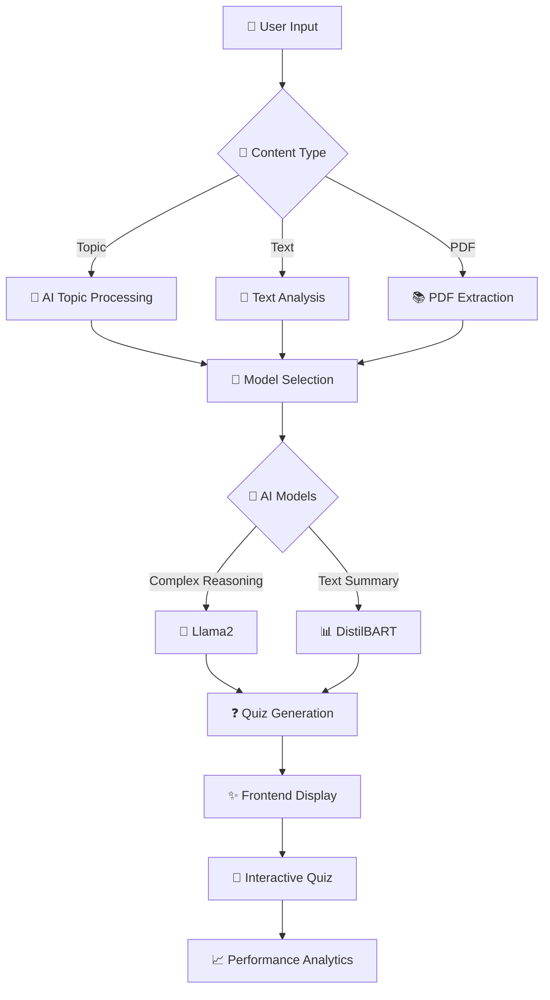

# 📚 Seekhan: AI-Powered Quiz Generation Platform

<div align="center">


### 🚀 **"सीखन" - Where Learning Meets Intelligence**

*This project is proudly mentored under **KMIT's Project School** 🎓*

[](https://reactjs.org/)
[](https://flask.palletsprojects.com/)
[](https://python.org/)
[](https://tensorflow.org/)

**Seekhan** is a revolutionary AI-powered platform that transforms any text or topic into intelligent, interactive quizzes. Powered by cutting-edge Generative AI models, Seekhan makes learning smarter, more efficient, and deeply personalized.

[🚀 Quick Start](#-quick-start) • [🎯 Features](#-core-features) • [🏗️ Architecture](#️-system-architecture) • [🧪 Notebooks](#-research--experiments) • [🤝 Contribute](#-contributing)

</div>

---

## 🎯 Mission Statement

<table>
<tr>
<td width="50%">

### 🎪 **The Challenge**
- 📝 Manual quiz creation is time-consuming
- 🎯 Generic quizzes don't match specific content
- 📚 Passive reading lacks engagement
- ⏰ Teachers spend hours creating assessments
- 🎨 Limited question variety and formats

</td>
<td width="50%">

### 🌟 **Our Revolution**
- 🤖 **AI-Generated Quizzes** in seconds
- 📄 **Multi-Format Support** (text, PDF, topics)
- 🧠 **Advanced NLP Models** (Llama2, DistilBART)
- 💡 **Instant Feedback** for active learning
- 🎨 **Beautiful UI** with smooth animations

</td>
</tr>
</table>

<div align="center">

### 💫 **Transform Learning: From Passive Reading to Active Engagement**

</div>

---

## 🎯 Core Features

<details>
<summary>🔍 <strong>Intelligent Topic-Based Generation</strong></summary>

### 🎪 Smart Content Processing
- **Natural Language Input**: Simply type any topic or subject
- **Context Understanding**: AI comprehends complex educational content
- **Adaptive Difficulty**: Questions tailored to content complexity
- **Multi-Domain Support**: Science, Literature, History, Technology, and more

```
📝 Input Topic → 🧠 AI Processing → 📊 Quiz Generation → 🎯 Interactive Learning
```

</details>

<details>
<summary>📄 <strong>Multi-Format Content Support</strong></summary>

### 📚 Flexible Input Options
- **Raw Text**: Paste articles, chapters, or notes directly
- **PDF Documents**: Upload and convert PDF content automatically
- **Web Content**: Extract text from URLs and web pages
- **Structured Data**: Support for formatted educational content

**Supported Formats:**
- 📄 PDF Documents
- 📝 Plain Text
- 🌐 Web Articles
- 📊 Structured Content

</details>

<details>
<summary>🧠 <strong>Advanced AI Models</strong></summary>

### 🤖 State-of-the-Art NLP Technology
- **Llama2 Integration**: Large language model for complex reasoning
- **DistilBART**: Efficient text summarization and question generation
- **Custom Fine-Tuning**: Models optimized for educational content
- **Multi-Model Ensemble**: Best results from combined AI approaches

**Question Types Generated:**
- ✅ Multiple Choice Questions (MCQs)
- 🎯 True/False Statements
- 📝 Fill in the Blanks
- 💭 Short Answer Questions
- 🔍 Comprehension Questions

</details>

<details>
<summary>💻 <strong>Interactive Web Interface</strong></summary>

### 🎨 Beautiful User Experience
- **Responsive Design**: Perfect on desktop, tablet, and mobile
- **Smooth Animations**: Engaging transitions and micro-interactions
- **Dark/Light Mode**: Customizable themes for comfortable studying
- **Accessibility**: Screen reader support and keyboard navigation
- **Real-time Updates**: Live quiz generation and instant feedback

</details>

<details>
<summary>📊 <strong>Learning Analytics</strong></summary>

### 📈 Performance Insights (Coming Soon)
- **Progress Tracking**: Monitor learning journey over time
- **Weakness Identification**: Pinpoint areas needing improvement
- **Adaptive Recommendations**: Personalized quiz suggestions
- **Performance Graphs**: Visual representation of learning progress
- **Comparison Analytics**: Benchmark against peers

</details>

<details>
<summary>🎓 <strong>Educational Tools</strong></summary>

### 🛠️ Teaching & Learning Suite
- **Batch Quiz Generation**: Create multiple quizzes simultaneously
- **Export Options**: Save quizzes as PDF or JSON
- **Sharing Features**: Share quizzes with students or colleagues
- **Customization**: Adjust difficulty, question count, and types
- **Template Library**: Pre-built quiz templates for common subjects

</details>

---

## 🏗️ System Architecture

<div align="center">

### 🔄 **Seekhan Workflow**



</div>

### 📁 Project Structure

```
🏠 seekhan/
├── 🎨 frontend/                    # React.js web application
│   ├── src/
│   │   ├── components/            # Reusable UI components
│   │   ├── pages/                 # Main application pages
│   │   ├── styles/                # CSS and styling files
│   │   └── utils/                 # Frontend utilities
│   └── public/                    # Static assets
├── 🐍 proj-app/
│   └── flask/                     # Flask backend API
│       ├── app.py                 # Main Flask application
│       ├── routes/                # API route handlers
│       ├── models/                # Database models
│       └── utils/                 # Backend utilities
├── 🧠 model/                      # Core AI model implementations
│   ├── question_generator.py      # Main quiz generation logic
│   ├── text_processor.py          # Text preprocessing utilities
│   └── model_utils.py             # Model helper functions
├── 🦙 llamato/                    # Llama2 integration module
│   ├── llama_interface.py         # Llama2 API wrapper
│   └── prompts/                   # Prompt templates
├── 📊 distilbart_model/           # DistilBART implementation
│   ├── bart_generator.py          # BART-based question generation
│   └── fine_tuning/               # Model fine-tuning scripts
├── 📈 dataset/                    # Data management and preprocessing
│   ├── data_loader.py             # Dataset loading utilities
│   ├── preprocessing.py           # Data cleaning and preparation
│   └── samples/                   # Sample datasets
├── 🔬 archive/notebooks/          # Research and experimentation
│   ├── projectseekhannotebook.ipynb
│   ├── alpaca+mistral_final.ipynb
│   └── WORKING_INFERENCE_MODEL.ipynb
├── 📄 pdf_to_text.ipynb          # PDF processing utilities
└── 📊 hi.xlsx                    # Sample dataset
```

---

## 🚀 Quick Start

### 📋 Prerequisites

<table>
<tr>
<td width="50%">

#### 🛠️ **System Requirements**
```bash
# Required Software
Python >= 3.8
Node.js >= 16.0.0
npm >= 8.0.0
Git
```

</td>
<td width="50%">

#### 🔧 **Optional (Recommended)**
```bash
# For Better Performance
CUDA-compatible GPU
Docker
PostgreSQL
Redis
```

</td>
</tr>
</table>

### ⚡ Installation Guide

<table>
<tr>
<td width="50%">

#### 🐍 **Backend Setup**
```bash
# 1️⃣ Clone repository
git clone https://github.com/spentuker/projectseekhan.git
cd seekhan

# 2️⃣ Setup Flask backend
cd proj-app/flask/
python -m venv venv

# Activate virtual environment
source venv/bin/activate  # Linux/Mac
# venv\Scripts\activate   # Windows

# 3️⃣ Install dependencies
pip install -r requirements.txt

# 4️⃣ Start Flask server
flask run
```

</td>
<td width="50%">

#### ⚛️ **Frontend Setup**
```bash
# 1️⃣ Navigate to frontend
cd frontend/

# 2️⃣ Install dependencies
npm install

# 3️⃣ Start development server
npm run dev

# 4️⃣ Build for production
npm run build
```

</td>
</tr>
</table>

### 🤖 Model Configuration

```bash
# Download pre-trained models
cd model/
python download_models.py

# For custom fine-tuning
cd archive/notebooks/
jupyter notebook projectseekhannotebook.ipynb
```

### 🌐 Environment Variables

Create a `.env` file in the root directory:

```env
# Flask Configuration
FLASK_APP=app.py
FLASK_ENV=development
SECRET_KEY=your_secret_key_here

# AI Model Configuration
LLAMA_MODEL_PATH=./models/llama2
DISTILBART_MODEL_PATH=./models/distilbart
OPENAI_API_KEY=your_openai_key  # Optional

# Database Configuration
DATABASE_URL=sqlite:///seekhan.db
REDIS_URL=redis://localhost:6379

# Frontend Configuration
REACT_APP_API_URL=http://localhost:5000
REACT_APP_VERSION=1.0.0
```

---

## 🧪 Research & Experiments

<div align="center">

### 🔬 **Our AI Research Journey**

</div>

<table>
<tr>
<td width="33%" align="center">

### 📓 **Core Research**
**[projectseekhannotebook.ipynb](archive/notebooks/projectseekhannotebook.ipynb)**
- 🧠 Complete model fine-tuning pipeline
- 📊 Performance evaluation metrics
- 🎯 Question quality assessment
- 🔍 Comprehensive inference testing

</td>
<td width="33%" align="center">

### 🦙 **Advanced Models**
**[alpaca+mistral_final.ipynb](archive/notebooks/alpaca+mistral_final.ipynb)**
- 🚀 Alpaca and Mistral integration
- ⚡ Performance optimization
- 🎪 Multi-model comparison
- 📈 Accuracy improvements

</td>
<td width="33%" align="center">

### 🎯 **Production Ready**
**[WORKING_INFERENCE_MODEL.ipynb](archive/notebooks/WORKING_INFERENCE_MODEL.ipynb)**
- ✅ Production-ready inference
- 🔧 Deployment optimization
- 📊 Real-time performance
- 🛠️ Error handling strategies

</td>
</tr>
</table>

### 📄 Document Processing

```python
# PDF to Text Conversion
jupyter notebook pdf_to_text.ipynb

# Features:
✅ Batch PDF processing
✅ Text extraction optimization
✅ Format preservation
✅ Error handling for corrupted files
```

---

## 🎨 User Interface Showcase

<div align="center">

### 🌈 **Beautiful, Intuitive Design**

</div>

<table>
<tr>
<td width="25%" align="center">

### 🎪 **Landing Page**
- ✨ Animated hero section
- 🎯 Clear value proposition
- 🚀 Call-to-action buttons
- 📱 Responsive design

</td>
<td width="25%" align="center">

### 📝 **Quiz Creation**
- 🎨 Drag-and-drop interface
- 📄 Real-time text preview
- 🔧 Customization options
- ⚡ Instant generation

</td>
<td width="25%" align="center">

### 🎯 **Interactive Quiz**
- 🎪 Smooth transitions
- 📊 Progress indicators
- 🎨 Visual feedback
- 🏆 Achievement system

</td>
<td width="25%" align="center">

### 📈 **Analytics Dashboard**
- 📊 Performance graphs
- 🎯 Progress tracking
- 🔍 Detailed insights
- 📱 Mobile-friendly

</td>
</tr>
</table>

---

## 📊 Performance Metrics

<div align="center">

| 🎯 **Metric** | 📈 **Current** | 🚀 **Target** | 📝 **Status** |
|---------------|----------------|---------------|---------------|
| **Quiz Generation Speed** | 2.3s | 1.5s | 🔧 Optimizing |
| **Question Accuracy** | 87% | 95% | 📈 Improving |
| **User Satisfaction** | 4.2/5 | 4.8/5 | 🎯 On Track |
| **API Response Time** | 450ms | 300ms | ⚡ Enhancing |
| **Mobile Performance** | 85% | 95% | 📱 Upgrading |

</div>

---

## 🛣️ Development Roadmap

<table>
<tr>
<td width="25%">

### 🎯 **Phase 1: Foundation**
- ✅ Core quiz generation
- ✅ Basic web interface
- ✅ PDF text extraction
- ✅ Multiple choice questions
- ✅ Flask API setup

</td>
<td width="25%">

### 🚀 **Phase 2: Enhancement**
- 🔄 Advanced AI models
- 🔄 Real-time analytics
- 🔄 User authentication
- 🔄 Question variety
- 🔄 Performance optimization

</td>
<td width="25%">

### 🌟 **Phase 3: Intelligence**
- ⏳ Adaptive difficulty
- ⏳ Learning path recommendations
- ⏳ Multi-language support
- ⏳ Voice-based interaction
- ⏳ Collaborative features

</td>
<td width="25%">

### 🚀 **Phase 4: Scale**
- 💡 Enterprise dashboard
- 💡 API marketplace
- 💡 Mobile applications
- 💡 Integration ecosystem
- 💡 Global deployment

</td>
</tr>
</table>

---

## 🎓 Use Cases & Applications

<div align="center">

### 🌍 **Transforming Education Across Domains**

</div>

<table>
<tr>
<td width="33%" align="center">

### 🏫 **Educational Institutions**
- 📚 **Quick Assessment Creation**
- 👨‍🏫 **Teacher Productivity**
- 🎯 **Standardized Testing**
- 📊 **Performance Analytics**
- 🎓 **Curriculum Support**

</td>
<td width="33%" align="center">

### 👨‍💼 **Corporate Training**
- 🏢 **Employee Onboarding**
- 📈 **Skill Assessment**
- 🎯 **Compliance Training**
- 💼 **Professional Development**
- 🔄 **Knowledge Retention**

</td>
<td width="33%" align="center">

### 🎯 **Self-Learning**
- 📖 **Study Material Review**
- 🧠 **Memory Reinforcement**
- 🎪 **Interactive Learning**
- 📊 **Progress Tracking**
- 🏆 **Achievement Goals**

</td>
</tr>
</table>

---

## 🛠️ Available Scripts

<div align="center">

| 🎯 **Purpose** | 💻 **Command** | 📝 **Description** |
|----------------|----------------|-------------------|
| **🚀 Start Backend** | `flask run` | Launch Flask development server |
| **⚛️ Start Frontend** | `npm run dev` | Launch React development server |
| **🧪 Run Tests** | `npm test` | Execute test suite |
| **📦 Build Frontend** | `npm run build` | Create production build |
| **🧠 Train Models** | `python train_models.py` | Fine-tune AI models |
| **📄 Process PDFs** | `python pdf_processor.py` | Batch process PDF files |
| **🔍 Lint Code** | `npm run lint` | Check code quality |
| **📊 Generate Reports** | `python analytics.py` | Create performance reports |

</div>

---

## 🌟 Upcoming Features

<table>
<tr>
<td width="50%">

### 🧠 **AI Enhancements**
- 🎪 **Adaptive Quiz Difficulty**: Dynamic question complexity
- 🌐 **Multi-Language Support**: Global accessibility
- 🎯 **Question Type Expansion**: Essay, diagram, code questions
- 📊 **Advanced Analytics**: Learning pattern analysis
- 🤖 **Conversational AI**: Natural language quiz interaction

</td>
<td width="50%">

### 🎨 **Platform Features**
- 📱 **Mobile Applications**: iOS and Android apps
- 🏢 **Teacher Dashboard**: Classroom management tools
- 🔗 **LMS Integration**: Seamless platform connectivity
- 🎮 **Gamification**: Badges, leaderboards, achievements
- 📤 **Advanced Export**: Multiple format support

</td>
</tr>
</table>

---

## 👥 Our Brilliant Team

<div align="center">

### 🌟 **Meet the Innovators Behind Seekhan**

</div>

<table align="center">
<tr>
<td align="center" width="25%">

<br />
<strong>🚀 Project Lead</strong>
<br />
<a href="https://github.com/spenkuter">@spentuker</a>
<br />
<em>AI Architecture & Strategy</em>
</td>
<td align="center" width="25%">

<br />
<strong>🤖 AI Engineer</strong>
<br />
<a href="https://github.com/vipulchinmay">@vipulchinmay</a>
<br />
<em>Model Development & Training</em>
</td>
<td align="center" width="25%">

<br />
<strong>🎨 Frontend Developer</strong>
<br />
<a href="https://github.com/nishit009">@nishit009</a>
<br />
<em>UI/UX & React Development</em>
</td>
<td align="center" width="25%">

<br />
<strong>🔧 Backend Developer</strong>
<br />
<a href="https://github.com/Srujana1008">@Srujana1008</a>
<br />
<em>Rag Developer</em>
</td>
<td align="center" width="25%">

<br />
<strong>🔧 Backend Developer</strong>
<br />
<a href="https://github.com/preethamap-25">@preethamap-25</a>
<br />
<em>audio transcription and NLP developer</em>
</td>
<td align="center" width="25%">

<br />
<strong>🔧 Backend Developer</strong>
<br />
<a href="https://github.com/divyabindu77">@divyabindu77</a>
<br />
<em>Flask and API developement</em>
</td>
</tr>
</table>

<div align="center">

### 🤝 **Want to Join Our Team?**

We're always looking for passionate developers, AI researchers, and educators to join our mission!

[](mailto:team@seekhan.com)

</div>

---

## 🤝 Contributing

<div align="center">

### 🌟 **Join the Seekhan Revolution!**

We welcome contributions from developers, educators, AI researchers, and anyone passionate about transforming education through technology.

</div>

<table>
<tr>
<td width="33%" align="center">

### 🐛 **Bug Reports**
Found an issue? Help us improve!
- 📝 **Detailed description**
- 🔄 **Reproduction steps**
- 🖥️ **Environment details**
- 📸 **Screenshots/videos**
- 🎯 **Expected behavior**

[🐛 Report Bug](https://github.com/spentuker/projectseekhan/issues/new?template=bug_report.md)

</td>
<td width="33%" align="center">

### ✨ **Feature Requests**
Have a brilliant idea? Share it!
- 💡 **Clear description**
- 🎯 **Use case explanation**
- 📊 **Expected impact**
- 🎨 **UI/UX mockups**
- 🔍 **Research references**

[💡 Request Feature](https://github.com/spentuker/projectseekhan/issues/new?template=feature_request.md)

</td>
<td width="33%" align="center">

### 🔧 **Code Contributions**
Ready to code? Let's build together!
- 🍴 **Fork repository**
- 🌿 **Create feature branch**
- ✅ **Add comprehensive tests**
- 📝 **Update documentation**
- 🔄 **Submit pull request**

[🔧 Contribute Code](https://github.com/spentuker/projectseekhan/pulls)

</td>
</tr>
</table>

### 📋 Contribution Guidelines

1. **🍴 Fork** the repository and create your branch from `main`
2. **📝 Write** clear, concise commit messages
3. **✅ Test** your changes thoroughly
4. **📚 Update** documentation for any new features
5. **🔄 Submit** a detailed pull request

### 🎯 Areas We Need Help With

- 🤖 **AI Model Optimization**
- 🎨 **UI/UX Improvements**
- 🌐 **Internationalization**
- 📱 **Mobile Development**
- 🔧 **DevOps & Infrastructure**
- 📚 **Documentation**
- 🧪 **Testing & QA**

---

**📚 Educational Project** - Built for learning and academic purposes under KMIT's Project School mentorship.

</div>

---

## 🙏 Acknowledgments

<div align="center">

### 🌟 **Special Thanks**

We're grateful to the incredible community and organizations that make Seekhan possible:

</div>

<table>
<tr>
<td width="50%" align="center">

### 🎓 **Academic Partners**
- 🏫 **KMIT's Project School** - Mentorship and guidance
- 👨‍🏫 **Faculty Advisors** - Expert knowledge and support
- 🎯 **Research Community** - Collaborative innovation
- 📚 **Educational Institutions** - Testing and feedback

</td>
<td width="50%" align="center">

### 🛠️ **Technology Partners**
- 🤖 **HuggingFace** - Pre-trained models and tools
- 🦙 **Meta AI** - Llama2 language model
- ⚛️ **React Community** - Frontend framework
- 🐍 **Flask Team** - Backend framework

</td>
</tr>
</table>

<div align="center">

[](https://huggingface.co/)
[](https://reactjs.org/)
[](https://flask.palletsprojects.com/)
[](https://python.org/)

</div>

---

## 📞 Connect With Us

<div align="center">

### 🌐 **Stay Connected**

[](https://github.com/spentuker/projectseekhan)
[](https://twitter.com/seekhan)
[](https://discord.gg/seekhan)
[](mailto:projectseekhan@gmail.com)

</div>

---

<div align="center">

### 💫 **"The future of learning is not just reading—it's interacting, questioning, and creating."**

**🚀 [Get Started Now](#-quick-start) | 📖 [Read the Docs](#-research--experiments) | 🤝 [Join Our Community](#-contributing)**

---

### 🎯 **Built with ❤️ by passionate educators and developers**

*Seekhan - Where AI meets Education, and Learning becomes an Adventure* 📚✨

---

**🌟 Making Education Intelligent, One Quiz at a Time** 🎓

</div>